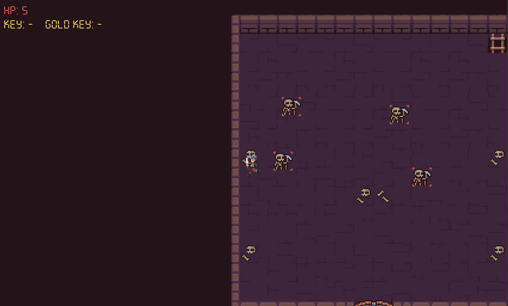

## Mini sprite based Game
### Controls
WASD - For movement

E - to interact with world objects

Space - To attack Enmeys 

### Gameplay features

Enemys - Skeleton

Boss - Skeleton Boss

Anmatied - Player character, (WIP) Skeleton/Boss

## Gameplay Art

## How To Run 
Go to the file directory of GameEngine

`....\GameEngine\Game\FinalGame\Game.cpp` 

And change 
`Line: 30 std::unique_ptr<nu::Game> game = std::make_unique<` **SpaceGame** `>();`

to
`Line: 30 std::unique_ptr<nu::Game> game = std::make_unique<` **FinalGame** `>();`

## Credit 

NotAWeedle (**Me**): Code

Smullen93 : Attack Sound fx

ManaRelicGames : Music

Unknow Author : 2D Pixel Dungeon Asset Pack v2.0